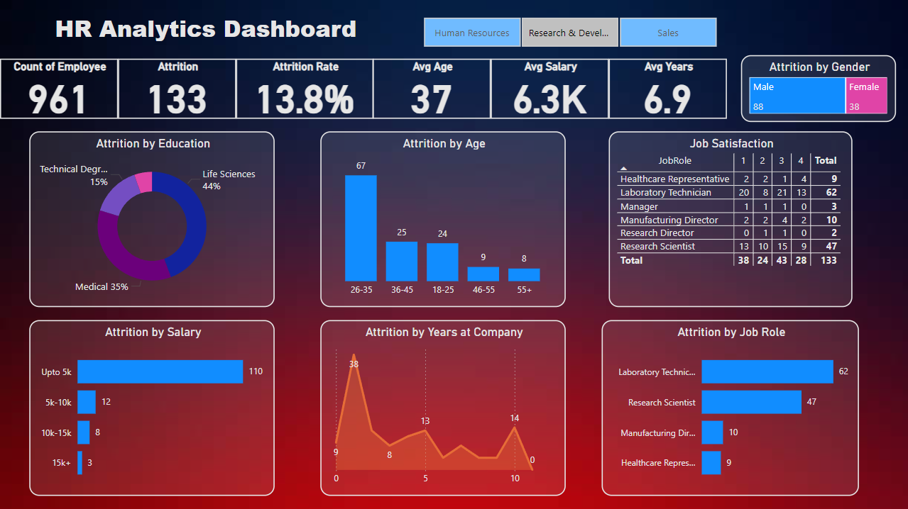

### HR Analytics Dashboard in Power BI  

This repository contains a **Power BI Dashboard** focused on HR Analytics, providing detailed insights into employee attrition and key workforce metrics. The dashboard enables users to explore data interactively and make informed, data-driven HR decisions.  

---

## 📊 **Dashboard Preview**  
  

---

## 🚀 **Features**  
- **Department-Wise Analysis**  
  Drill down into HR metrics for each department.  
- **Attrition Trends**  
  Analyze employee attrition based on:  
  - Age  
  - Salary  
  - Job Role  
  - Job Satisfaction  
  - Education Level  
  - Years at the Company  
- **Interactive Visualizations**  
  Dynamic charts and graphs make it easy to uncover trends and patterns.  
- **Customizable Filters**  
  Filter data to focus on specific segments or criteria.  

---

## 📂 **Repository Contents**  
- **`HR_Analytics.pbix`**: Power BI file containing the dashboard.  
- **`HR Analytics.csv`**: A sample dataset to help you explore the dashboard (if included).  
- **`Documentation.md`**: Step-by-step guide to setting up and using the dashboard.  

---

## 🛠️ **Getting Started**  

1. Clone this repository:  
   ```bash  
   git clone https://github.com/atharvaK718/HR-Analytics-on-PowerBI.git   
   ```  

2. Open the `.pbix` file in Power BI Desktop.  

3. Load your dataset or use the provided sample data to explore the dashboard.  

---

## 🎯 **Use Cases**  
- Identify high-risk areas for employee attrition.  
- Understand how job satisfaction, salary, and other factors influence employee retention.  
- Compare department-wise metrics to align HR strategies effectively.  

---

## 🤝 **Contributing**  
We welcome contributions! If you have ideas or improvements:  
1. Fork the repository.  
2. Create a new branch.  
3. Submit a pull request.  
 
